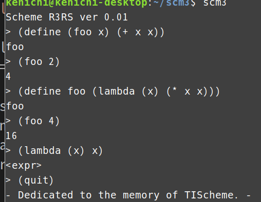

# MACLISP-like Interpreter

This project is an attempt to recreate **MACLISP** in 1980.  
It is based on a small C Lisp interpreter and aims to provide a MACLISP-like experience.

## Installation

Compile and install using:

```bash
sudo make install
```

This will create an executable named lisp in /usr/local/bin.
Usage

Start the interpreter by running:
```
maclisp
```
Exit the interpreter by typing:
```
(quit)
```


## Functions
```
> oblist
(NIL T PLUS DIFFERENCE MINUS TIMES QUOTIENT DIVIDE ADD1 SUB1 MAX MIN
 RECIP REMAINDER EXPT QUIT HDMP CAR CDR CONS LIST REVERSE LENGTH APPEND NCONC RPLACA RPLACD MAPLIST MAPCON MAP EQ EQUAL NULL ATOM GBC READ
 EVAL APPLY PRINT PRIN1 GREATERP LESSP ZEROP ONEP MINUSP NUMBERP FIXP
 SYMBOLP LISTP ASSOC MEMBER SET NOT QUOTE SETQ DEFUN LAMBDA MACRO IF
 BEGIN COND AND OR COMMENT)
> 
```

## Example

```
MACLISP 1980
> (defun foo (x) (x))
T
> (foo 3)
3
> 

```


## Notes

This is not a full MACLISP implementation, but a simplified version that captures the feel of the original.

Dynamic scoping is used.

Core functions like QUOTE, ATOM, EQ, CONS, CAR, CDR, and COND are implemented.

see DOCUMENT.md