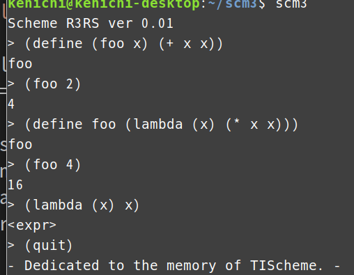

**“This software is a technology created for peace and freedom.  
It does not wish to serve, in any way, as a tool for oppression, suppression, human rights violations, or dictatorship.”**


# R3RS Scheme Interpreter

This project is an attempt to recreate **TI Scheme** in 1980.  
It is based on a small C Lisp interpreter and aims to provide a CPS continuation.

## Installation

Compile and install using:

```bash
sudo make install
```

This will create an executable named lisp in /usr/local/bin.
Usage

Start the interpreter by running:
```
scm3
```
Exit the interpreter by typing:
```
(exit)
```



## Example

```
Scheme R3RS
> (define (foo x) x)
T
> (foo 3)
3
> 

```


## Notes
This implementation is not fully R3RS-compliant. It does not include bignums or complex numbers. It focuses specifically on Scheme's unique continuations and closures.

see DOCUMENT.md

## A Note on Its Smallness

This system is intentionally kept small. It is not meant for practical use; rather, it is designed as a learning tool and for educational purposes.

Because the implementation is deliberately minimal, it is easy to understand as a whole. Once you have grasped its structure, you can move on to a more practical system—or simply appreciate this little interpreter for what it is.

It will probably never serve in a real application, but if browsing through its compact codebase brings you a moment of comfort or relaxation, the author could ask for nothing more.

call/cc: The `call/cc` implementation in scm3 is incomplete.

As shown below, it works in typical top-level use cases.
Scheme R3RS ver 1.70
> (define f #f)
f
> (+ 1 2 (call/cc (lambda (c) (set! f c) 0)))
3
> f
<cont>
> (f 10)
13
> 


However, it does not behave correctly in situations involving the built-in
`for-each` procedure and similar higher-order control constructs.

scm3 is intended as an educational interpreter.
Please treat this project as a hint or starting point for developing your own
fully compliant implementation.